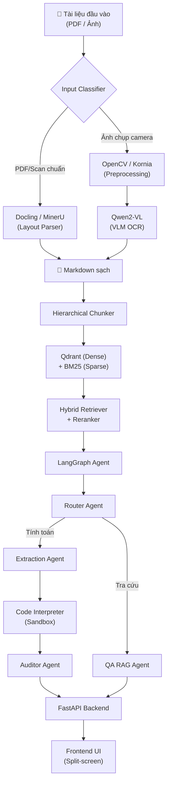
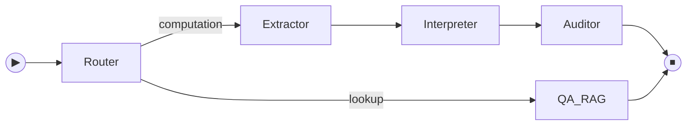
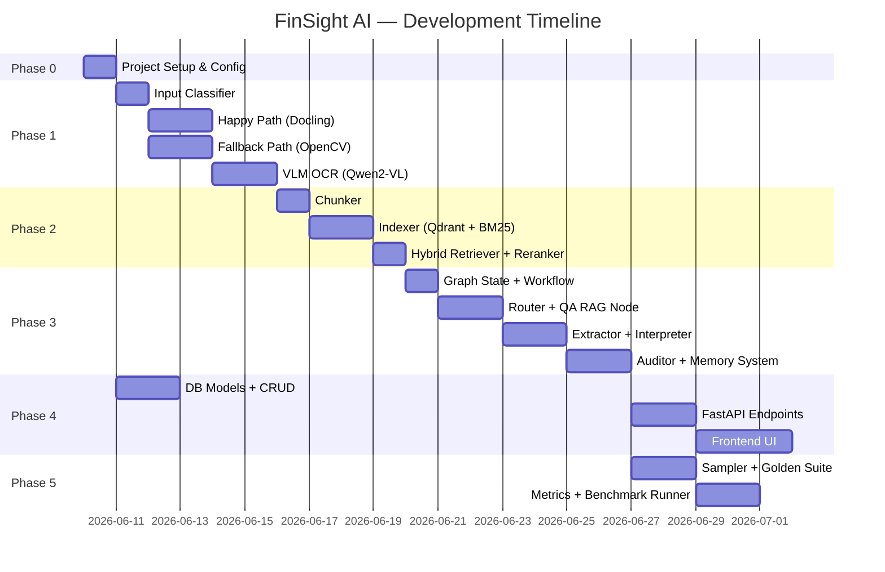

# FinSight AI — Implementation Plan

> **Dự án:** Smart Financial Auditor — Hệ thống AI kiểm toán tài chính tự động
> **Bỏ qua:** `advanced_system_design.md` (chưa cần ở giai đoạn này)

---

## Tổng Quan Kiến Trúc



---

## Phase 0: Project Skeleton & Environment

| # | Task | Chi tiết | Output |
|---|------|----------|--------|
| 0.1 | Khởi tạo cấu trúc thư mục | Tạo toàn bộ tree theo `structure_project.md` | Thư mục hoàn chỉnh |
| 0.2 | Python venv + requirements | Python 3.11, chia `requirements-core.txt` / `requirements-dev.txt` | venv sẵn sàng |
| 0.3 | Config module | `src/config.py` — env vars, API keys, VRAM allocation | Config singleton |
| 0.4 | `.gitignore` + `.env.example` | Chặn `data/`, `.env`, `__pycache__` | Git sạch |
| 0.5 | Docker skeleton | `Dockerfile.api`, `Dockerfile.sandbox`, `docker-compose.yml` (placeholder) | DevOps cơ bản |

### Dependencies chính (Phase 0)

```text
# Core
python-dotenv, pydantic, pydantic-settings

# Tầng 1
docling, opencv-python-headless, kornia, transformers, qwen-vl-utils

# Tầng 2  
llama-index, qdrant-client, sentence-transformers (BGE-M3), rank-bm25

# Tầng 3
langgraph, langchain-core, langchain-google-genai

# Tầng 4
fastapi, uvicorn, sse-starlette, sqlalchemy, alembic, asyncpg

# Evaluation
datasets (HuggingFace), python-Levenshtein, pandas
```

---

## Phase 1: Tầng 1 — Data Ingestion & Layout Parsing

### 1.1 Input Classifier (`src/ingestion/classifier.py`)

| Việc cần làm | Chi tiết |
|---------------|----------|
| Kiểm tra MIME type | PDF → Happy Path, Image → phân tích tiếp |
| Phân biệt scan vs camera | Dùng metadata EXIF (camera model) + phân tích histogram pixel (độ nghiêng, noise level) |
| Return | `InputType` enum: `DIGITAL_PDF`, `SCANNED_IMAGE`, `CAMERA_PHOTO` |

### 1.2 Happy Path (`src/ingestion/path_happy.py`)

```python
# Pseudocode flow
def process_happy(file_path: Path) -> str:
    doc = docling.parse(file_path)  # hoặc MinerU
    
    markdown_parts = []
    for element in doc.elements:
        if element.type == "text":
            markdown_parts.append(element.text)
        elif element.type == "table":
            markdown_parts.append(element.to_markdown_table())
        elif element.type == "figure":
            description = vlm_describe_figure(element.image)
            markdown_parts.append(f"[Figure: {description}]")
    
    return "\n\n".join(markdown_parts)
```

### 1.3 Fallback Path (`src/ingestion/path_fallback.py`)

| Bước | Kỹ thuật | Thư viện |
|------|----------|----------|
| Deskew (xoay thẳng) | Hough Transform → tính góc nghiêng → rotate | OpenCV |
| Khử bóng (Shadow removal) | Gaussian blur + divide normalization | OpenCV |
| Tăng contrast | CLAHE (Contrast Limited Adaptive Histogram Equalization) | OpenCV |
| Lọc ngưỡng | Adaptive Threshold (Otsu) | OpenCV |

### 1.4 VLM OCR (`src/ingestion/vlm_ocr.py`)

- Model: **Qwen2-VL-2B** (local) hoặc **Gemini Flash** (cloud fallback)
- Sliding window cho ảnh dài (tỷ lệ Cao/Rộng > 2.5)
- System Prompt chuyên dụng ép output Markdown table format
- Trả về `confidence_score` cho ảnh camera chất lượng thấp

---

## Phase 2: Tầng 2 — Indexing & Hybrid Retrieval

### 2.1 Chunker (`src/retrieval/chunker.py`)

```python
# Chiến lược chunking
# 1. Split theo Header (##, ###) 
# 2. Bảng Markdown KHÔNG được cắt đôi → giữ nguyên 1 chunk
# 3. Metadata per chunk: {source_file, page_num, chunk_type: "text"|"table"|"figure"}
```

### 2.2 Indexer (`src/retrieval/indexer.py`)

| Index | Model | Storage |
|-------|-------|---------|
| Dense Vector | `BAAI/bge-m3` hoặc `nomic-embed-text` | Qdrant |
| Sparse BM25 | rank-bm25 | In-memory / Qdrant sparse |

### 2.3 Retriever (`src/retrieval/retriever.py`)

```text
Query → [Dense Search (top 10)] + [BM25 Search (top 10)]
     → Merge & Deduplicate
     → bge-reranker-large (top 3)
     → Return Context Chunks
```

### 2.4 Vector DB Setup (`src/core/vector_db.py`)

- Qdrant client config (local mode hoặc Docker)
- Collection creation with proper vector dimensions

---

## Phase 3: Tầng 3 — Agentic Reasoning (LangGraph)

### 3.1 Graph State (`src/agents/state.py`)

```python
from typing import TypedDict, Optional, List

class AgentState(TypedDict):
    query: str                          # Câu hỏi người dùng
    input_type: str                     # "lookup" | "computation"
    context_chunks: List[str]           # Chunks từ Tầng 2
    extracted_data: Optional[dict]      # JSON số liệu đã trích xuất
    code_result: Optional[str]          # Kết quả từ Code Interpreter
    confidence_score: Optional[float]   # Từ VLM (ảnh chụp)
    audit_report: Optional[str]         # Báo cáo kiểm toán
    final_answer: str                   # Câu trả lời cuối cùng
    messages: List[dict]                # Chat history
```

### 3.2 Workflow Graph (`src/agents/workflow.py`)



### 3.3 Nodes chi tiết

| Node | File | Nhiệm vụ |
|------|------|-----------|
| **Router** | `nodes/router.py` | Phân loại intent bằng LLM prompt |
| **QA RAG** | `nodes/qa_rag.py` | Trả lời ngữ nghĩa từ context chunks |
| **Extractor** | `nodes/extractor.py` | Trích xuất số liệu → JSON `{field: value}` |
| **Interpreter** | `nodes/interpreter.py` | Sinh Python code, chạy trong sandbox, trả kết quả |
| **Auditor** | `nodes/auditor.py` | Đối chiếu kết quả vs tài liệu gốc, cảnh báo sai lệch |

### 3.4 Memory System

| Module | File | Cơ chế |
|--------|------|--------|
| Short-term | `memory/short_term.py` | Load 10 tin nhắn gần nhất từ `chat_messages` vào Graph State |
| Long-term | `memory/long_term.py` | Async worker: cuối phiên → LLM tóm tắt → upsert `user_longterm_memory` |

---

## Phase 4: Database & Backend (Tầng 4)

### 4.1 Database Schema (`src/database/models.py`)

4 bảng chính (PostgreSQL + SQLAlchemy):

| Bảng | Quan hệ | Mục đích |
|------|---------|----------|
| `users` | — | Người dùng (UUID PK, username, email) |
| `chat_sessions` | users 1→N | Phiên làm việc (metadata JSONB lưu danh sách file) |
| `chat_messages` | sessions 1→N | Lịch sử chat (role, content, tokens_used) — **Short-term memory** |
| `user_longterm_memory` | users 1→N | Tri thức đúc kết (memory_type, content) — **Long-term memory** |

### 4.2 Database Manager (`src/database/manager.py`)

```python
# Core operations
async def create_session(user_id, title, metadata) -> ChatSession
async def save_message(session_id, role, content, tokens) -> ChatMessage
async def get_recent_messages(session_id, limit=10) -> List[ChatMessage]
async def get_user_memories(user_id) -> List[LongTermMemory]
async def upsert_memory(user_id, memory_type, content) -> LongTermMemory
```

### 4.3 FastAPI Endpoints (`api/`)

| Endpoint | Method | Mô tả |
|----------|--------|--------|
| `/auth/register` | POST | Đăng ký |
| `/auth/login` | POST | Đăng nhập |
| `/documents/upload` | POST | Upload PDF/ảnh → trigger Ingestion pipeline |
| `/chat/sessions` | GET | Danh sách phiên chat |
| `/chat/{session_id}` | GET | Lịch sử chat |
| `/chat/{session_id}/ask` | POST | Gửi câu hỏi → SSE stream response |

### 4.4 Alembic Migrations

- `src/database/migrations/` — quản lý schema versioning

---

## Phase 5: Evaluation & Benchmark

### 5.1 Golden Test Suite (`evaluation/`)

| Dataset | Source (HuggingFace) | Size | Test Target |
|---------|---------------------|------|-------------|
| Invoice Math | `Voxel51/high-quality-invoice-images-for-ocr` | 50 ảnh | OCR + Toán |
| Layout Diverse | `mychen76/invoices-and-receipts_ocr_v2` | 30 ảnh | Bố cục đa dạng |
| RAG Finance | `TheFinAI/FinQA_v2` | 30 docs | RAG + Agent |
| Fallback (Noisy) | `Theivaprakasham/wildreceipt` | 40 ảnh | Ảnh nghiêng/tối |
| Ink Noise | `davidle7/funsd-json` | 30 ảnh | Chữ mờ nhạt |

### 5.2 Metrics (`evaluation/metrics.py`)

| Metric | Công thức | Áp dụng cho |
|--------|-----------|-------------|
| **ANLS** | Levenshtein similarity | OCR text extraction |
| **Exact Match** | Số == Đáp án (0 hoặc 1) | Agent computation |
| **Hit Rate @K=3** | Chunk đúng ∈ Top 3? | RAG retrieval |
| **CER Reduction** | (CER_raw - CER_processed) / CER_raw × 100 | Fallback OpenCV |

---

## Thứ Tự Triển Khai Đề Xuất



---

## Ghi Chú Quan Trọng

> [!IMPORTANT]
> - **Ưu tiên Tầng 1 → 2 → 3 trước**, vì đây là core pipeline. Tầng 4 (API/UI) có thể song song hoá.
> - **Database models** nên làm sớm (Phase 0) vì Tầng 3 Memory phụ thuộc vào nó.
> - **Evaluation** nên viết metrics sớm để test từng tầng ngay khi code xong.

> [!TIP]
> - Dùng **Qdrant local mode** khi dev (không cần Docker), chuyển Docker khi deploy.
> - Tách `Dockerfile.sandbox` riêng cho Code Interpreter → cách ly bảo mật.
> - `confidence_score` từ VLM là tín hiệu quan trọng cho Auditor Agent.
