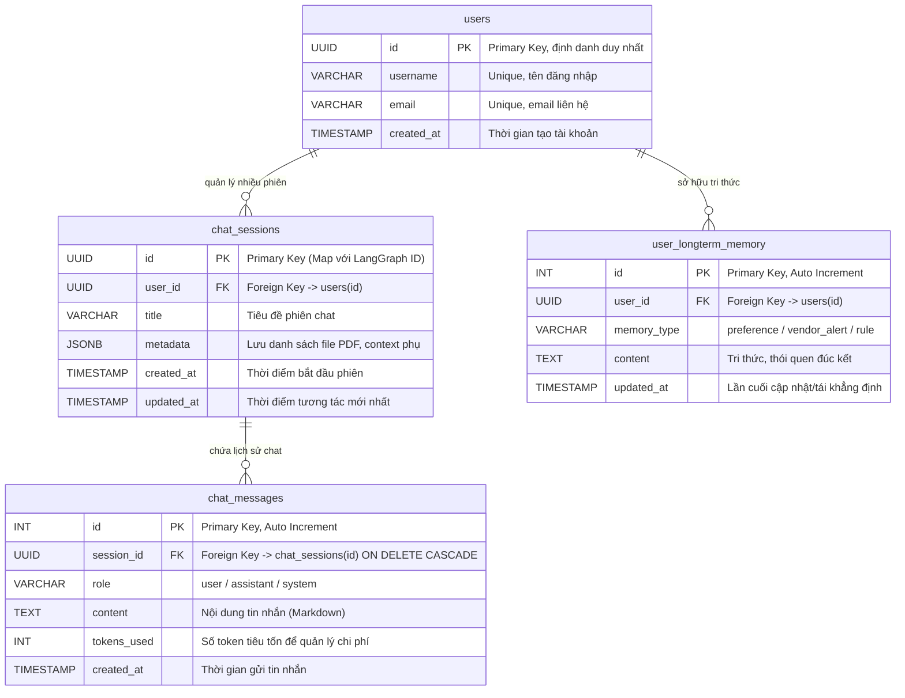
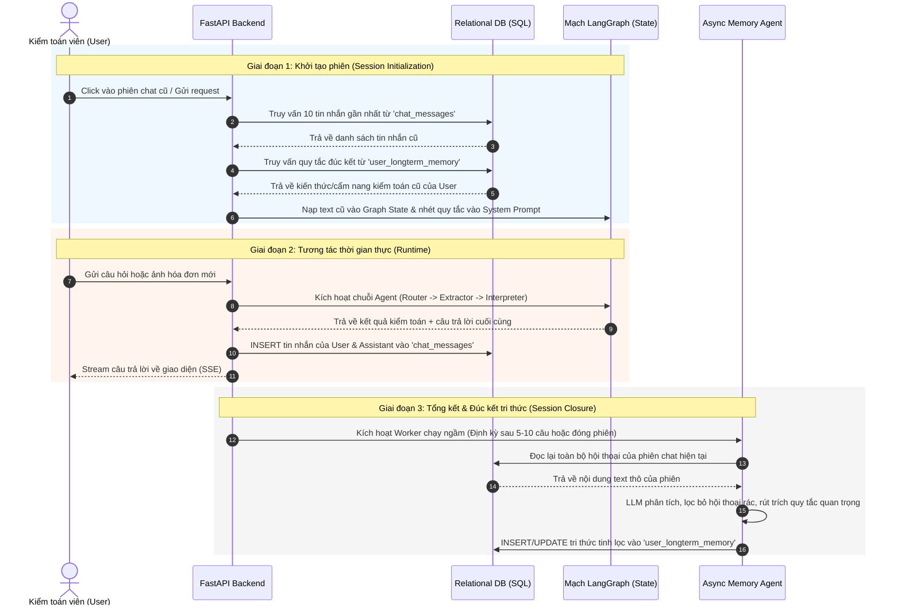

# 1. Sơ đồ thực thể (Database ER Schema)

Sơ đồ này mô tả mối quan hệ $1 - n$ chặt chẽ giữa người dùng, các phiên làm việc, lịch sử tin nhắn (bộ nhớ ngắn hạn) và tri thức tích lũy (bộ nhớ dài hạn).



# 1. Thiết Kế Sơ Đồ Thực Thể (Database ER Schema)

Trong một hệ thống Agentic AI, cấu trúc bảng cần được thiết kế chặt chẽ để đảm bảo mối quan hệ (1 - n) (Một người dùng có nhiều phiên chat, một phiên chat có nhiều tin nhắn).

---

## Bảng 1: `users` (Quản lý người dùng)

Lưu trữ thông tin cơ bản của kế toán viên hoặc kiểm toán viên sử dụng hệ thống.

| Tên Trường (Field) | Kiểu Dữ Liệu | Thuộc Tính (Constraints)    | Ý Nghĩa                    |
| ------------------ | ------------ | --------------------------- | -------------------------- |
| id                 | UUID / INT   | Primary Key, Auto Increment | ID duy nhất của người dùng |
| username           | VARCHAR(50)  | Unique, Not Null            | Tên đăng nhập              |
| email              | VARCHAR(100) | Unique, Not Null            | Email liên hệ              |
| created_at         | TIMESTAMP    | Default Current_Timestamp   | Thời gian tạo tài khoản    |

---

## Bảng 2: `chat_sessions` (Quản lý phiên chat)

Mỗi khi người dùng tải lên một hoặc một nhóm hóa đơn mới để kiểm tra, một phiên chat (Session) mới sẽ được tạo ra.

| Tên Trường (Field) | Kiểu Dữ Liệu   | Thuộc Tính (Constraints)    | Ý Nghĩa                                                  |
| ------------------ | -------------- | --------------------------- | -------------------------------------------------------- |
| id                 | UUID / VARCHAR | Primary Key                 | ID phiên chat (Dùng để map với LangGraph ID)             |
| user_id            | INT / UUID     | Foreign Key -> users(id)    | Phiên chat này thuộc về ai                               |
| title              | VARCHAR(255)   | Not Null                    | Tiêu đề phiên (Ví dụ: "Đối soát hóa đơn T8/2025")        |
| metadata           | JSONB / TEXT   | Nullable                    | Lưu trữ thông tin phụ (Ví dụ: danh sách file PDF đã nạp) |
| created_at         | TIMESTAMP      | Default Current_Timestamp   | Thời điểm bắt đầu phiên chat                             |
| updated_at         | TIMESTAMP      | On Update Current_Timestamp | Thời điểm có tương tác mới nhất                          |

---

## Bảng 3: `chat_messages` (Quản lý tin nhắn - Short-term Memory)

Lưu trữ toàn bộ lịch sử hội thoại.

Đây chính là nguồn cung cấp **Bộ nhớ ngắn hạn (Short-term Memory)** cho mô hình.

Mỗi lần người dùng hỏi câu mới, hệ thống sẽ vào đây bốc lại (N) tin nhắn gần nhất để đưa vào ngữ cảnh cho LLM hiểu họ đang nói về cái gì.

| Tên Trường (Field) | Kiểu Dữ Liệu | Thuộc Tính (Constraints)                           | Ý Nghĩa                                          |
| ------------------ | ------------ | -------------------------------------------------- | ------------------------------------------------ |
| id                 | INT / UUID   | Primary Key, Auto Increment                        | ID tin nhắn                                      |
| session_id         | UUID         | Foreign Key -> chat_sessions(id) ON DELETE CASCADE | Tin nhắn thuộc phiên nào (Xóa phiên thì xóa tin) |
| role               | VARCHAR(20)  | Not Null (Check: 'user', 'assistant', 'system')    | Ai là người nói                                  |
| content            | TEXT         | Not Null                                           | Nội dung tin nhắn (Chuỗi Markdown)               |
| tokens_used        | INT          | Nullable                                           | Số lượng token tiêu tốn (Để quản lý chi phí API) |
| created_at         | TIMESTAMP    | Default Current_Timestamp                          | Thời gian gửi tin nhắn                           |

---

## Bảng 4: `user_longterm_memory` (Bộ nhớ dài hạn / Đúc kết kiểm toán)

Đây chính là điểm "ăn tiền" làm nên tính thông minh của hệ thống.

Thay vì lưu toàn bộ tin nhắn rác, cuối mỗi phiên chat, một Agent ngầm sẽ tổng hợp các thói quen, hành vi hoặc quy tắc kiểm toán mà người dùng hay nhắc tới để lưu vào đây.

### Ví dụ

Người dùng hay giao lệnh:

> "Nhớ kiểm tra kỹ thuế VAT của nhà cung cấp X vì họ hay tính sai".

Hệ thống sẽ biến nó thành một dòng bộ nhớ dài hạn.

Lần sau ở phiên chat khác, khi gặp nhà cung cấp X, Agent tự động bốc dòng memory này lên để cảnh giác.

| Tên Trường (Field) | Kiểu Dữ Liệu | Thuộc Tính (Constraints)                      | Ý Nghĩa                                                |
| ------------------ | ------------ | --------------------------------------------- | ------------------------------------------------------ |
| id                 | INT / UUID   | Primary Key, Auto Increment                   | ID bộ nhớ                                              |
| user_id            | INT / UUID   | Foreign Key -> users(id)                      | Bộ nhớ dài hạn này gắn chặt với người dùng nào         |
| memory_type        | VARCHAR(50)  | Not Null (E.g., 'preference', 'vendor_alert') | Phân loại bộ nhớ                                       |
| content            | TEXT         | Not Null                                      | Nội dung đúc kết (Ví dụ: "Nhà cung cấp X hay lỗi VAT") |
| updated_at         | TIMESTAMP    | On Update Current_Timestamp                   | Lần cuối cập nhật hoặc tái khẳng định bộ nhớ           |

---

# 2. Cơ Chế Hoạt Động Của Bộ Nhớ Trong Hệ Thống (Memory Mechanism)

Khi tích hợp đồ thị LangGraph với cơ sở dữ liệu SQL này, luồng đi của bộ nhớ sẽ vận hành theo chu kỳ đóng-mở chặt chẽ:

## Giai đoạn mở đầu (Session Initialization)

Người dùng bấm vào một phiên chat cũ.

FastAPI gọi Database bốc ngược lại 10 tin nhắn gần nhất từ bảng `chat_messages`:

```text
chat_messages
        ↓
10 tin nhắn gần nhất
        ↓
LangGraph State
        ↓
LLM nhớ lại ngữ cảnh cũ
```

Đồng thời, bốc luôn các quy tắc trong bảng `user_longterm_memory` của user đó để đưa vào System Prompt làm "cẩm nang tác nghiệp".

```text
user_longterm_memory
          ↓
System Prompt
          ↓
Agent nhận các quy tắc cá nhân hóa
```

---

## Giai đoạn tương tác (Runtime)

Người dùng hỏi, Agent trả lời:

```text
User Message
      ↓
Agent Response
      ↓
Insert Database
      ↓
chat_messages
```

Hai bản ghi mới lập tức được Insert thẳng vào bảng `chat_messages` theo thời gian thực để cập nhật lịch sử.

---

## Giai đoạn đóng/Tổng kết (Session Closure)

Khi phiên chat kết thúc (hoặc định kỳ sau 5-10 câu thoại), một Memory Agent chạy ngầm (Asynchronous Worker) sẽ đọc lại toàn bộ phiên chat.

```text
Toàn bộ phiên chat
          ↓
Memory Agent
          ↓
Phân tích thông tin quan trọng
          ↓
user_longterm_memory
```

Agent sẽ phân tích xem có thông tin nào quan trọng đáng lưu giữ lâu dài không.

Nếu có, nó sẽ tự động cập nhật hoặc thêm mới vào bảng `user_longterm_memory`.

# 2. Cơ chế hoạt động của Bộ nhớ (Memory Mechanism)

Sơ đồ tuần tự (Sequence Diagram) dưới đây mô tả chu kỳ đóng - mở dữ liệu khép kín giữa Người dùng, FastAPI Backend, Cơ sở dữ liệu SQL và Mạch trạng thái của LangGraph.


