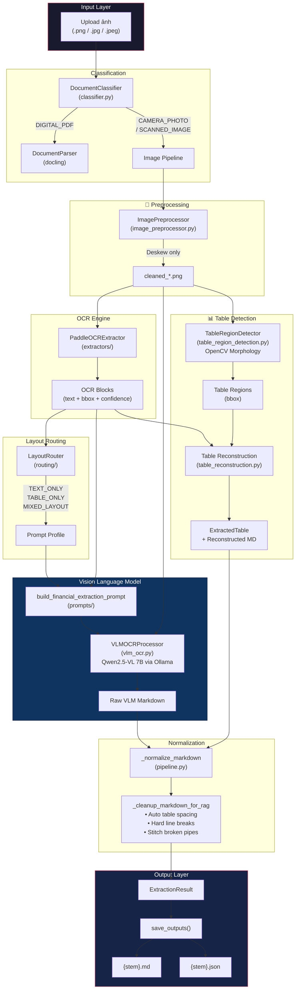

# 📄 FinSight AI — Ingestion Pipeline

> **Module chịu trách nhiệm chuyển đổi tài liệu thô (ảnh chụp, ảnh scan) thành Markdown có cấu trúc, sẵn sàng nạp vào hệ thống RAG.**

---

## 📐 Kiến trúc tổng quan



---

## 📁 Cấu trúc thư mục

```
src/ingestion/
├── pipeline.py                    # Orchestrator chính — điều phối toàn bộ luồng
├── classifier.py                  # Phân loại đầu vào (PDF / Scan / Camera)
├── image_preprocessor.py          # Tiền xử lý ảnh (Cân bằng sáng CLAHE + Deskew)
├── vlm_ocr.py                     # Gọi Qwen2.5-VL qua Ollama (LangChain)
├── table_region_detection.py      # Phát hiện vùng bảng bằng OpenCV Morphology
├── table_reconstruction.py        # Dựng lại cấu trúc bảng từ OCR blocks + bbox
│
├── extractors/                    # OCR Engines
│   └── paddle_ocr_extractor.py    # PaddleOCR 2.x/3.x wrapper
│
├── prompts/                       # Prompt Engineering
│   ├── __init__.py
│   └── vlm_prompts.py             # Language-agnostic VLM prompts
│
├── routing/                       # Layout Intelligence
│   ├── __init__.py
│   └── layout_router.py           # Auto-route dựa trên OCR signal
│
└── schemas/                       # Data Models
    ├── __init__.py
    └── extraction_result.py       # OCRBlock, ExtractedTable, ExtractionResult...
```

---

## Chi tiết từng module

### 1. `pipeline.py` — Orchestrator chính

**Class: `IngestionPipeline`**

File lõi điều phối toàn bộ luồng xử lý. Nhận file path đầu vào, chạy qua từng phase, và trả về `ExtractionResult` chứa Markdown + JSON metadata.

| Method                                  | Chức năng                                                            |
| --------------------------------------- | -------------------------------------------------------------------- |
| `run(file_path)`                        | Entry point — chạy end-to-end extraction                             |
| `save_outputs(result)`                  | Lưu `.md` + `.json` vào `data/processed/`                            |
| `index_result(result)`                  | Chunk + index Markdown vào Vector DB (Qdrant)                        |
| `_extract_image_like(path)`             | Luồng xử lý ảnh chính (PaddleOCR → VLM → Normalize)                  |
| `_extract_digital_pdf(path)`            | Luồng PDF (Docling parser) — _chưa triển khai đầy đủ_                |
| `_normalize_markdown(...)`              | Chuẩn hóa output VLM, fallback tự động (dựng lại từ OCR) nếu VLM rỗng |
| `_cleanup_markdown_for_rag(...)`        | Sửa lỗi format: table spacing, hard line breaks, stitch broken pipes |
| `_reconstruct_tables_with_regions(...)` | Kết hợp OCR blocks + table bbox → structured tables                  |
| `_classify_quality(result)`             | Chấm điểm chất lượng output cuối cùng                                |

---

### 2. `classifier.py` — Phân loại đầu vào

**Class: `DocumentClassifier`**

Nhận file path và trả về `InputType` enum:

| InputType       | Mô tả                          | Luồng xử lý            |
| --------------- | ------------------------------ | ---------------------- |
| `DIGITAL_PDF`   | File PDF gốc (có text layer)   | → Docling parser       |
| `SCANNED_IMAGE` | Ảnh scan phẳng, sắc nét        | → Image Pipeline (VLM) |
| `CAMERA_PHOTO`  | Ảnh chụp camera (méo, mờ, lóa) | → Image Pipeline (VLM) |

> **Lưu ý hiện tại:** Toàn bộ file ảnh đều được ép qua luồng `CAMERA_PHOTO` để tận dụng tối đa sức mạnh của VLM trong việc khôi phục dấu và dựng bảng.

---

### 3. `image_preprocessor.py` — Tiền xử lý ảnh

**Class: `ImagePreprocessor`**

Thực hiện **hai thao tác** tăng cường nhẹ nhàng bằng OpenCV:

1. **Auto-brightness (CLAHE)**: Tự động phát hiện ảnh tối mờ và cân bằng sáng có chọn lọc (chỉ vùng tối mới được làm sáng), giúp PaddleOCR và VLM đọc nét chữ rõ hơn mà không gây lóa.
2. **Deskew**: Xoay thẳng ảnh dựa trên góc nghiêng tổng thể của các cụm từ (minAreaRect).

**Triết lý thiết kế:** Tuyệt đối không bóp méo hay biến đổi nặng (như Blur, Denoise mạnh) để giữ nguyên pixel cấu trúc văn bản gốc cho VLM phân tích.

```
Input: ảnh gốc (có thể bị nghiêng, thiếu sáng)
  ↓ Auto-brightness (nếu quá tối)
  ↓ Deskew (xoay thẳng)
Output: cleaned_*.png (rõ ràng, ngay ngắn)
```

---

### 4. `extractors/paddle_ocr_extractor.py` — PaddleOCR Engine

**Class: `PaddleOCRExtractor`**

Wrapper quanh PaddleOCR với các tính năng:

- **Lazy-loading:** Chỉ khởi tạo engine khi cần, tránh tốn RAM khi import.
- **Auto-fallback:** Tự động phát hiện PaddleOCR 3.x hoặc 2.x và dùng API tương ứng.
- **Multi-language:** Map config languages (`vi`, `en`, `ch`, `ja`, `ko`) sang PaddleOCR lang.
- **Output chuẩn hóa:** Trả về `list[OCRBlock]` thống nhất bất kể version PaddleOCR.

**Vai trò trong pipeline:** PaddleOCR **không phải** là công cụ đọc chữ cuối cùng. Nó chỉ cung cấp **sườn ký tự cơ bản + tọa độ vị trí (bbox)** để:

1. VLM dùng làm "bản nháp" chống ảo giác (anti-hallucination).
2. LayoutRouter dùng để phân tích cấu trúc tài liệu.
3. TableReconstruction dùng để dựng lại bảng từ vị trí.

---

### 5. `vlm_ocr.py` — Vision Language Model

**Class: `VLMOCRProcessor`**

Gọi **Qwen2.5-VL 7B** qua Ollama (LangChain `ChatOllama`) để đọc ảnh và sinh Markdown.

- Ảnh được encode sang Base64 và gửi kèm prompt.
- VLM nhận cả ảnh lẫn OCR blocks (trong prompt) để:
  - Nhìn ảnh → hiểu bố cục, nhận diện bảng, đọc dấu ngôn ngữ.
  - Đọc OCR text → giữ chính xác ký tự gốc, chỉ thêm dấu.

**Đây là "bộ não" chính của pipeline**, chịu trách nhiệm sinh ra Markdown cuối cùng.

---

### 6. `prompts/vlm_prompts.py` — Prompt Engineering

**Function: `build_financial_extraction_prompt()`**

Xây dựng System Prompt hoàn toàn **Language-Agnostic** (đa ngôn ngữ) với các lớp bảo vệ:

| Lớp                    | Nội dung                                                          |
| ---------------------- | ----------------------------------------------------------------- |
| **Core Instructions**  | Output Markdown thuần, không JSON, không code block               |
| **Anti-Hallucination** | Ép dùng OCR text làm sườn, chỉ được thêm dấu, CẤM thay thế chữ    |
| **Profile Rules**      | Tùy chỉnh theo layout (`TEXT_ONLY`, `TABLE_ONLY`, `MIXED_LAYOUT`) |
| **OCR Context**        | Danh sách OCR blocks kèm confidence score                         |

---

### 7. `routing/layout_router.py` — Layout Intelligence

**Class: `LayoutRouter`**

Phân tích thống kê OCR blocks để tự động quyết định chiến lược xử lý:

```
OCR Blocks → Tính toán metrics → Phân loại layout → Chọn Prompt Profile
```

Thứ tự | Điều kiện (Metrics) | Layout Mode | Prompt Profile kích hoạt | Ghi chú hành vi của VLM
--- | --- | --- | --- | ---
**1 (Critical)** | `total_blocks == 0` hoặc `avg_conf < 0.35` | `critical_fail` | `MIXED_LAYOUT` | Bắn cờ cần người review, ảnh không đủ tín hiệu để chạy tiếp.
**2 (Quality)** | `avg_conf < 0.65` | `noisy_scan` | `ANTI_HALLUCINATION_MIXED` | Bật ép VLM đối chiếu nghiêm ngặt tọa độ bbox OCR, cấm tự bịa số.
**3 (Layout)** | `marker_ratio > 0.15` và `aligned_ratio > 0.4` | `table_rich` | `TABLE_PRIORITY` | Tập trung dựng bảng, **vẫn phải trích xuất text tiêu đề/footer** kèm theo.
**4 (Layout)** | `numeric_ratio < 0.1` và `long_text_ratio > 0.7` | `clean_text` | `TEXT_PRIORITY` | Đọc text bình thường, **nếu gặp bảng nhỏ thì không được bỏ qua**.
**5 (Default)** | Không thuộc các trường hợp trên | `mixed_layout` | `MIXED_LAYOUT` | Chế độ cân bằng, xử lý song song cả text và table.  |

**Metrics được tính:**

- `avg_ocr_confidence` — Độ tin cậy trung bình
- `numeric_ratio` — Tỷ lệ block chứa số
- `money_ratio` — Tỷ lệ block giống số tiền
- `marker_ratio` — Tỷ lệ block chứa từ khóa bảng (STT, Total, VAT...)
- `aligned_ratio` — Tỷ lệ block nằm thẳng hàng (dấu hiệu bảng)

---

### 8. `table_region_detection.py` — Phát hiện vùng bảng

**Class: `TableRegionDetector`**

Sử dụng OpenCV Morphology để tìm vùng bảng trên ảnh:

1. Nhị phân hóa ảnh (Adaptive Threshold).
2. Trích xuất đường kẻ ngang và dọc bằng Erosion + Dilation.
3. Gộp thành lưới (grid), tìm contour bao quanh.
4. Fallback: dùng Canny Edge nếu lưới quá yếu.

**Output:** `list[TableRegion]` — danh sách bbox của các vùng bảng, đã merge overlap.

---

### 9. `table_reconstruction.py` — Dựng lại cấu trúc bảng

Nhận OCR blocks + Table Regions → nhóm blocks theo hàng/cột → dựng `ExtractedTable`.

Đây là cơ chế **backup** cho trường hợp VLM không trả về Markdown table. Pipeline ưu tiên tin tưởng output VLM, chỉ dùng reconstructed table khi VLM hoàn toàn rỗng.

---

### 10. `schemas/extraction_result.py` — Data Models

Tất cả dataclass chuẩn hóa output của pipeline:

| Class              | Mô tả                                                             |
| ------------------ | ----------------------------------------------------------------- |
| `OCRBlock`         | Một block text: `text`, `confidence`, `bbox`, `language`          |
| `ExtractedTable`   | Bảng: `name`, `columns`, `rows`                                   |
| `ConfidenceReport` | Điểm tin cậy: OCR, layout, table, overall                           |
| `ExtractionResult` | **Output cuối cùng** — chứa tất cả: markdown, tables, metadata... |

---

## Các Phase của Pipeline (Image Path)

### Phase 1: Classification

```
File → classifier.py → InputType (CAMERA_PHOTO)
```

### Phase 2: Preprocessing

```
Ảnh gốc → ImagePreprocessor.deskew() → cleaned_*.png
```

### Phase 3: OCR Extraction

```
cleaned_*.png → PaddleOCRExtractor → list[OCRBlock]
```

### Phase 4: Layout Analysis

```
OCR Blocks → LayoutRouter → LayoutRoute (layout_mode, prompt_profile)
```

### Phase 5: VLM Extraction (Core)

```
cleaned_*.png + OCR Blocks + Prompt Profile
    → build_financial_extraction_prompt()
    → VLMOCRProcessor (Qwen2.5-VL 7B)
    → Raw Markdown
```

### Phase 6: Table Detection & Reconstruction (Parallel)

```
cleaned_*.png → TableRegionDetector → Table Regions
OCR Blocks + Table Regions → reconstruct_tables_from_ocr() → ExtractedTable[]
```

### Phase 7: Normalization & Cleanup

```
Raw Markdown → _normalize_markdown() → _cleanup_markdown_for_rag()
    • Chèn dòng trống trước bảng (table spacing)
    • Ép xuống dòng cứng cho text thường (hard line breaks: "  ")
    • Khâu dấu | bị rớt dòng (stitch broken pipes)
    • Loại bỏ dòng trùng lặp
```

### Phase 8: Validation & Scoring

```
Result → _classify_quality() → quality_class, quality_score
Result → _calculate_confidence() → ConfidenceReport
```

### Phase 9: Output

```
ExtractionResult → save_outputs()
    → data/processed/{stem}.md    (Markdown cho RAG)
    → data/processed/{stem}.json  (Full metadata)
```

---

## ⚙️ Cấu hình (config/setting.yaml)

```yaml
llm:
  ollama:
    base_url: "http://localhost:11434"
    model: "qwen2.5:7b" # LLM text thường
    vlm_model: "qwen2.5vl:7b" # Vision Language Model
    embed_model: "nomic-embed-text"

ingestion:
  ocr:
    enabled: true
    languages: ["vi", "en"]
    use_gpu: false
  post_correction:
    enabled: true
    model: "qwen2.5vl:3b"
```

---

## Testing

### Test đơn lẻ

```bash
python scratch/test_markdown_ocr.py "data/raw/ocr_eval/bad_cases/anh_chup_dien_thoai_meo.png"
```

### Test hàng loạt (batch)

```bash
python scratch/test_batch.py
```

Output sẽ được lưu tại:

- `data/processed/{tên_ảnh}.md` — Markdown
- `data/processed/{tên_ảnh}.json` — JSON metadata

---

## Triết lý thiết kế

1. **VLM-First:** Qwen2.5-VL 7B là "bộ não" chính. PaddleOCR chỉ là "mắt kính" hỗ trợ.
2. **Anti-Hallucination:** VLM bị ép phải dựa trên sườn text của PaddleOCR, chỉ được thêm dấu, không được thay chữ.
3. **Language-Agnostic:** Toàn bộ prompt bằng tiếng Anh trung lập, không hardcode ngôn ngữ cụ thể.
4. **Minimal Preprocessing:** Chỉ dùng cân bằng sáng (CLAHE) cho ảnh quá tối và xoay thẳng (Deskew), tuyệt đối không denoise/sharpen/contrast — giữ nguyên nét pixel nguyên bản cho VLM dễ đọc.
5. **Graceful Fallback:** VLM rỗng → Reconstructed Table → OCR linear text.
6. **Code-level Fix > Prompt Fix:** Các lỗi format Markdown (broken tables, collapsed paragraphs) được sửa bằng thuật toán Python, không ép vào prompt.
